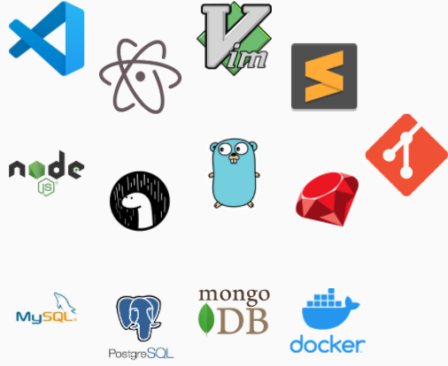
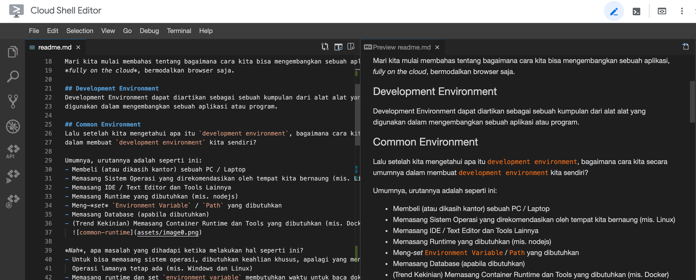

# Coding on Cloud

## Table of Content
1. [Development Environment](#development-environment)
1. [Common Environment](#common-environment)
1. [Apa itu Cloud Shell](#apa-itu-cloud-shell)
1. [Demo Coding on Cloud Shell](#demo-coding-on-cloud-shell)
1. [Limitasi Cloud Shell](#limitasi-cloud-shell)
1. [References](#references)

### Last Update
7 Dec 2020

### Disclaimer:
Bagi yang ingin melihat sekilas ini tentang apa (tanpa demo), dapat dilihat di sini yah.  
[Slide Cloud Shell](https://docs.google.com/presentation/d/1VRqML7jh32zmvi16VH67bg-Ciaw8ZtSZrvghB9fDULY)

Mari kita mulai membahas tentang bagaimana cara kita bisa mengembangkan sebuah aplikasi,
*fully on the cloud*, bermodalkan browser saja.

## Development Environment
Development Environment dapat diartikan sebagai sebuah kumpulan dari alat alat yang
digunakan dalam mengembangkan sebuah aplikasi atau program.

## Common Environment
Lalu setelah kita mengetahui apa itu `development environment`, bagaimana cara kita secara umumnya
dalam membuat `development environment` kita sendiri?

Umumnya, urutannya adalah seperti ini:
- Membeli (atau dikasih kantor) sebuah PC / Laptop
- Memasang Sistem Operasi yang direkomendasikan oleh tempat kita bernaung (mis. Linux)
- Memasang IDE / Text Editor dan Tools Lainnya
- Memasang Runtime yang dibutuhkan (mis. nodejs)
- Meng-*set* `Environment Variable` / `Path` yang dibutuhkan
- Memasang Database (apabila dibutuhkan)
- (Trend Kekinian) Memasang Container Runtime dan Tools yang dibutuhkan (mis. Docker)
  

*Nah*, apa masalah yang dihadapi ketika melakukan hal seperti ini?
- Untuk bisa memasang sistem operasi, dibutuhkan keahlian khusus, apalagi yang menginginkan Sistem
  Operasi lamanya tetap ada (mis. Windows dan Linux)
- Memasang runtime dan set `environment variable` membutuhkan waktu untuk baca dokumentasi
- Memasang container runtime (khususnya pada non Sistem Operasi Linux) membutuhkan perangkat keras
  dengan spesifikasi yang cukup mumpuni
- Memiliki PC / Laptop dengan spesifikasi yang ***KENTANG*** namun ingin menjalankan runtime yang
  membutuhkan spesifikasi yang cukup tinggi.
    - Sebagai contoh VSCode + nodejs + postgres + pgAdmin4 dengan membuka *Browser* 5 *Tab* 
      pada sistem operasi Windows membutuhkan RAM > 4 GB.
    - Apabila dengan kondisi seperti di atas, kita hanya memiliki spesifikasi Laptop dengan RAM 4GB
      saja, maka tentunya akan cukup terkendala menghadapi kondisi di atas.

Kemudian sekarang pertanyaannya adalah:
```
Bagaimana caranya kita menyelesaikan kondisi di atas?
```

Salah satunya adalah dengan pertanyaan berikut:
```
Bagaimana bila seandainya kita bisa memindahkan sumber daya / spesifikasi yang dibutuhkan di atas
ke dunia `awan` *cloud computing* ?

Sehingga kita hanya butuh untuk membuka browser saja dan kita sudah bisa memulai mengembangkan aplikasi kita?
```

Sebenarnya sudah ada beberapa solusi atas jawaban di atas:
- Codespaces by Github (Beta, invitation only)
- Gitpod.io (Berbayar, versi Free hanya 50 Jam per Bulan)
- Cloud Shell Editor by Google Cloud Platform

Pada artikel ini yang akan dibahas adalah dengan menggunakan `Editor on the Cloud` 
by Google Cloud Platform (GCP) atau selanjutnya disebut dengan `Cloud Shell Editor` saja

## Apa itu Cloud Shell
Sebelum mengetahui apa itu Cloud Shell dan Editornya, ada baiknya kita mengetahui apa itu 
GCP terlebih dahulu.

GCP adalah layanan penyedia *cloud computing* yang berasal dari perusahaan aplikasi mesin pencari 
yang besar di dunia, **Google**.

Cloud Shell, menurut GCP sendiri, adalah sebuah mesin administrasi yang dikurasikan oleh Google 
sendiri yang memiliki akses terhadap sumber daya GCP yang *powerful*, aman secara *default*, dengan
berbagai macam tools yang telah disediakan dan siap untuk digunakkan.

Caption: Sneak Peek - Cloud Shell


**Disclaimer**  
Contoh di atas hanya menjelaskan operating system Linux nya saja, belum menjelaskan
penuh tentang Editor yang akan dibahas pada saat demo.

Secara sederhananya, dari kacamata developer, adalah
```
Sebuah sistem operasi Linux, yang sudah memiliki banyak tools dan runtime yang terpasang dan siap
digunakan untuk mengembangkan aplikasi.
```

Tools apa sajakah yang sudah tersedia di dalam Cloud Shell ?
(Untuk list lengkap dapat dilihat di [sini](https://cloud.google.com/shell/docs/how-cloud-shell-works))

| Tipe | Tool |
| ---- | ---- |
| Linux Shell | bash |
| | sh   |
| Linux Utiliies | Utilities standar Debian |
| Text Editors | Emacs |
| | vim |
| | nano |
| Tools Pengembangan | npm |
| | nvm |
| | pip |
| | composer |
| Versioning | git |
| | mercurial |
| Tambahan | docker |
| | MySQL Client |

Untuk Cloud Shell ini sendiri pun, GCP sudah menyediakan paket lengkap yang dapat digunakan, salah
satunya dengan diberikan adanya `Cloud Shell Editor`.

Dengan adanya `Cloud Shell Editor` ini, sesuai namanya, kita mendapatkan sebuah Code / Text Editor
yang menggunakan infrastruktur dari GCP, sehingga hanya bermodalkan sebuah *browser* saja,
kita dapat membuat kode dan menjalankannya secara langsung di dalam infrastruktur GCP. 
Menyenangkan *kan*?

Caption: Sneak Peek - Cloud Shell Editor


Nah dengan tools seperti ini (yang terlihat cukup terbatas ini) 
apa sajakah yang dapat kita lakukan?

*Yuk* kita coba melihat demo untuk melakukan pengembangan aplikasi sederhana dengan
Cloud Shell.

## Demo Coding on Cloud Shell
Sebelum menggunakan Cloud Shell ini, ada sedikit requirement yang harus dilakukan terlebih dahulu:
- Memiliki Akun GMail

Ya, syaratnya adalah hanya dengan memiliki sebuah akun GMail saja ! karena GCP ini akan terikat
dengan akun GMail yang kita miliki.

Dalam demo ini kita akan:
1. Buka Cloud Shell Editor
2. Setup / "Provision" aplikasi / server yang dibutuhkan dalam docker (PostgreSQL dan Adminer)
3. Cloning and run the code.

Langkah-langkah yang akan dilakukan:
1. Pertama tama kita akan membuka Cloud Shell Editor kita dengan membuka tautan
   [Cloud Shell Editor](https://ide.cloud.google.com)
1. Pada saat halaman ini terbuka, lakukan login dengan akun GMail kita.
1. Menunggu sebentar untuk provisioning infrastruktur dari GCP...
1. Setelah diberikan halaman utama `Cloud Shell Editor`,  Membuka terminal dalam 
   `Cloud Shell Editor` dengan cara membuka tab `Terminal` -> `New Terminal`
   (Shortcut ``CTRL + SHIFT + ` ``)
1. Setelah terminal terbuka, kita akan meng-clone sourcecode dengan menggunakan `git`, dan tentu
   saja, `git` sudah disediakan dalam terminal `Cloud Shell` ini. kita tinggal mengetik
   ```sh
   git clone https://github.com/withered-flowers/learn-code-on-cloud 
   ```
1. Selanjutnya pada terminal kita akan berpindah ke halaman sources dengan cara mengetik
   ```sh
   cd learn-code-on-cloud/sources
   ```
1. Selanjutnya kita akan menggunakan Postgres dan Adminer, sebagai Database dan Client-Tools
   dari databasenya, yang akan dipasang di dalam `docker`, tenang saja, `docker` ini secara default
   juga sudah disediakan di dalam `Cloud Shell` ini. Pada demo ini juga sudah disediakan sebuah
   file dengan nama `docker-compose.yaml` untuk mempermudah langkah yang ada ini yah. kita
   dapat menjalankannya dengan cara mengetik:
   ```sh
   docker-compose up -d
   ```
   Dengan menjalankan ini, docker akan memprovision `Postgres` sebagai database server pada port
   `5432` dan provision `Adminer` pada port `8080`.
1. Selanjutnya kita akan membuka `Adminer` yang telah disediakan pada port `8080` dan membuat sebuah
   database dengan nama `development`. 
   Karena kita menggunakan infrastruktur yang disediakan GCP, kita tidak bisa membuka langsung
   dengan mengetik `localhost:8080`, tapi kita harus menggunakan cara `Cloud Shell`. Kita akan
   membukanya dengan menekan tombol `Web Preview` yang disediakan pada kanan atas 
   `Cloud Shell Editor`, dan memilih `Preview on port 8080`.  

   Caption: - Cloud Shell - Web Preview  
   
1. Setelah dibukakan halaman adminer tersebut, lakukanlah login dengan credential sebagai berikut:
   - system: `PostgreSQL`
   - server: `db`
   - username: `postgres`
   - password: `postgres`
   - database: (kosongkan)
1. Setelah berhasil login, buatlah sebuah database `Create Database` dengan nama `development`,
   selanjutnya kita akan kembali ke `Cloud Shell Editor` kita
1. Setelah membuat database dengan nama `development`, selanjutnya kita akan membuat tabel dan
   memasukkan data awal dengan menggunakan nodejs `sequelize`, tenang saja, nodejs pun sudah
   terinstall pada `Cloud Shell`, sehingga kita tinggal memanfaatkannya saja
1. Selanjtunya, pada `Cloud Shell` di folder yang sama, ketiklah perintah berikut:
   ```sh
   npm install && npm run initDb
   ```
   Pada perintah ini, kita akan menginstall `package` yang dibutuhkan oleh nodejs untuk menjalankan
   aplikasi ini, dan menginisialisasi data yang ada pada database.

1. Selanjutnya, pada file `app.js` kita akan memodifikasi kode sehingga menjadi seperti ini:
    ```javascript
    // import the express library
    const express = require('express')
    const app = express()

    // sequelize model
    const { book } = require('./models/index.js')

    // using port 10000
    // port 3000 has been used by internal GCP
    const port = process.env.PORT || 10000

    // using the pug as view engine
    app.set('view engine', 'pug')

    // define the endpoint

    // GET /
    app.get('/', async (req, res) => {
        const books = await book.findAll()
        res.render('index', { books })
    })

    // run the express server
    app.listen(port, () => {
        console.log(`Application is running on port ${port}`)
    })
    ```
1. Selanjutnya kita akan menjalankan aplikasi ini dengan mengetik perintah pada `Cloud Shell` 
   dengan cara:
   ```sh
   npm run dev
   ```
   Ketika perintah ini selesai dijalankan, akan muncul tulisan 
   `Application is running on port 10000`. dan kita akan mencoba melihat aplikasi kita pada
   port `10000`.
1. Untuk dapat membuka port `10000`, pada layar di kanan atas, klik tombol `Web Preview`, 
   kemudian pilih `Change Port`, dan masukkan port number menjadi `10000` dan tekan tombol
   `Change and Preview`, kemudian kita akan melihat sebuah tabel dengan 3 buah data yang
   telah diambil dari database PostgreSQL.
1. Selamat ! sampai dengan tahap ini artinya kita sudah berhasil menggunakan `Cloud Shell + Editor`
   untuk membuat sebuah aplikasi yang menggunakan database !

## Limitasi Cloud Shell
Tiada gading yang tak retak, begitu pula dengan Cloud Shell ini sendiri, pastinya akan ada
harga yang harus dibayarkan karena kita menggunakan Cloud Shell ini sendiri, yang selanjutnya akan
kita sebut sebagai limitasi Cloud Shell.

Limitasi Cloud Shell ini adalah:
- Limitasi dari Editor nya sendiri yang menggunakan Theia-based Editor, salah satunya adalah kita
  tidak bisa menambahkan ekstensi yang umumnya dapat kita gunakan pada Editor yang digunakan pada
  komputer kita sendiri.
- Limitasi dari Cloud Shell sendiri, dimana:
  - Tempat penyimpanan / storage yang diberikan hanya dapat disimpan pada `/home/<namauser>` saja.
  - State pada aplikasi tidak dapat disimpan, hanya kode-nya saja (Cloud Shell memiliki idle time
    sekitar 30 menit, apabila tidak ada aktivitas dari pengguna, maka Cloud Shell akan direstart
    secara otomatis dan akan kembali ke state awal, kecuali data yang disimpan pada 
    `/home/<namauser>`)
  - Debugging aplikasi yang cukup sulit (karena menggunakan Editor Theia, cara debuggingnya berbeda)
  - Data tidak disimpan dalam storage offline 
    - Apabila mau kode tersebut harus didownload atau ditaruh pada server repo lainnya 
      (mis. Github)
  - Belum dapat digunakan untuk `Mobile App Development`, karena tidak bisa digunakan untuk usb
    debugging / emulator
  - Limitasi Waktu
      - Cloud Shell sendiri hanya memiliki batas waktu sekitar 50 jam per minggu.

## TL;DR
- Dengan Cloud Shell, kita mendapatkan sebuah `Development Environment` berbasis browser, dan kita
  dapat mendevelop aplikasi on cloud.
- Ada limitasi sehingga sehingga target developmentnya cukup spesifik
    - Web Based Development, belum bisa Mobile App development
- Ada limitasi lainnya
    - Khususnya dari sisi `waktu` yang diberikan
- Masih bisa dieksplorasi lebih lanjut lagi
    - mis. integrasi Cloud Shell dengan Editor yang ada di PC / Laptop, sehingga bisa
      menuliskan kode di PC / Laptop, dan menjalankan aplikasi pada Cloud Shell.
        - Membagi alam penulisan kode dan menjalankan aplikasi.

## References
- [Techopedia - Development Environment Definition](https://www.techopedia.com/definition/16376/development-environment)
- [Available Tools - Cloud Shell](https://cloud.google.com/shell/docs/how-cloud-shell-works)